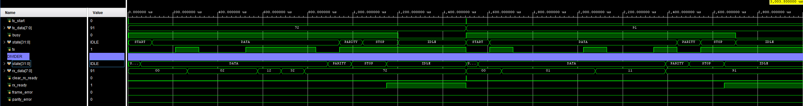
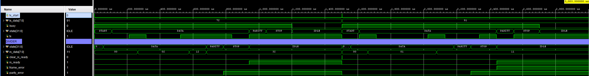

Pearl-Geyser-RV32E will be a 5-stage pipelined processor core implementing the RISC-V RV32E base-integer instruction set.

## Project Goals
1. My previous processor core project, [Topaz-Geyser-RV32E](https://github.com/justinscottlee/Topaz-Geyser-RV32E), needed 6 pipeline stages because of the way I handled the data path for MEM instructions. As a hard rule for this project, I want to avoid making this compromise and instead handle MEM instructions in a more organized way.
2. Implement a proper MMU for the core. The hope is that this will make having memory-mapped devices fit more cleanly in the design and also allow me to practice what I've learned about page tables and virtual memory spaces.
3. Make an effort to document the code better with more thorough comments throughout. My previous projects are sparsely commented which is something I don't like.

## UART Module Testing
&emsp;The first image displays the UART TX and RX waveforms with both sides using the same config (9600 baud rate, 8 data bits, 1.5 stop bits, odd parity, and lsb-first bit order). The correct data is received in both the 0x72 and 0x91 cases, and no framing erorrs or parity errors are detected.

&emsp;The second image display the UART TX and RX waveforms with the receiver mis-configured to 6 data bits. For the first data word, 0x72, the parity check fails but there is no framing error detected because it is only based on valid stop bits. For the second data word, the receiver detects both a parity and framing error.

